# DoseRules Extraction Flowchart

## 1. Purpose

Visual decision tree mirroring [`doserule-extraction-prompt.md`](doserule-extraction-prompt.md) under a fixed set of scope assumptions. Use this diagram alongside the prompt when reasoning about how a single free-text formulary paragraph maps to one or more `rules[]` entries in the extraction output, and further downstream to the flat `DoseRuleData` rows + TSV that GenFORM actually consumes.

## 2. Scope assumptions

The flowchart applies only when all four assumptions hold. The prompt itself remains the authoritative spec.

1. **Source given** — `source` (NKF / FK / SWAB / protocol id) is fixed per input file, not split inside the flow.
2. **Indication given** — `indication` is fixed per input context, not split inside the flow.
3. **Product identification manual** — `form`, `brand`, `gpks` are added by manual refinement after extraction.
4. **Department manual** — `dep` (department / ward) is added by manual refinement after extraction.

## 3. Flowchart

```mermaid
%%{init: {'theme': 'neutral'}}%%
flowchart TD
    A[Free-text formulary paragraph] --> A2[Curate text: grammar & punctuation]
    A2 --> CTX[Given context:<br/>Source, Generic, Indication<br/>fixed per input]
    CTX --> R{Split by route?}
    R -- N routes --> R1[N rules entries per route]
    R -- single --> R2[1 rules entry]
    R1 --> B
    R2 --> B{Split by patient group}
    B -- N disjoint groups --> C[N rules entries per group]
    B -- single --> D[1 rules entry]
    C --> E
    D --> E{Split by dose type / phase}
    E -- "N phases (start, maintenance, taper, load…)" --> F[N doseTypes entries]
    E -- single --> G[1 doseTypes entry]
    F --> H
    G --> H{Dose limit granularity?<br/>uniform per doseType<br/>no mixing}
    H -- per component --> I[Emit component-only entry<br/>1 doseLimit per component<br/>substance defaults to component name]
    H -- per substance --> J[Emit component+substance entries<br/>1 doseLimit per substance<br/>shared component for combos]
    I --> UNQ
    J --> UNQ[Validate uniqueness:<br/>doseType, doseText, component, substance<br/>quadruple unique per rule]
    UNQ --> K[Apply §4 field rules:<br/>age days, weight grams, BSA m²,<br/>decimal dot, JSON arrays,<br/>verbatim indication/scheduleText/doseText]
    K --> M[Manual refinement post-flow:<br/>form, brand, gpks, dep]
    M --> L[Emit JSON object: rules]
    L --> CONV[Conversion.toDoseRuleData<br/>flatten hierarchy:<br/>cartesian over doseTypes × doseLimits]
    CONV --> DRD[DoseRuleData rows<br/>one per doseType × doseLimit pair<br/>Informedica.GenFORM.Lib Types.fs]
    DRD --> TSV[Conversion.toTsvRow<br/>write 51-column TSV<br/>data/sources/Rules/doserules.tsv]
    TSV --> GF[GenFORM ingest<br/>Informedica.GenFORM.Lib]
```



**Downstream pipeline (post-emit):**

```text
L: Emit JSON
   ↓
CONV: Conversion.toDoseRuleData
      (flatten hierarchy — cartesian doseTypes × doseLimits)
   ↓
DRD: DoseRuleData[] rows in memory
     (Informedica.GenFORM.Lib / Types.fs)
   ↓
TSV: Conversion.toTsvRow
     (51-col tab-separated write to data/sources/Rules/doserules.tsv)
   ↓
GF:  GenFORM ingest (authoritative consumer)
```

Everything from `A` through `L` is LLM-facing (the extraction prompt scope). Everything from `CONV` onward runs in `src/Informedica.NLP.Lib/Scripts/DoseRuleExtract.fsx` and is code-only.

> **Note on "component-only entry"**: prompt §4.3 requires `substance` to be present in every dose limit. The component-only branch still emits `substance`; it defaults to the component name when no per-substance differentiation exists. The label is shorthand for "1 dose limit per component, no per-substance fan-out".

## 4. Cardinality

Per input text (fixed `source` + `generic` + `indication`):

```text
rules.length          = #routes × #patient groups
doseTypes per rule    = #phases for that (route, patient group)
doseLimits per doseType:
  component-level     = #components in generic (typically 1)
  substance-level     = Σ substances across all components in generic
```

Granularity is **uniform per doseType**; no mixing. Each component (resp. substance) carries at most one dose limit.

## 5. Mapping to prompt sections

| Flowchart concept              | Prompt §                         | Status                                         |
|--------------------------------|----------------------------------|------------------------------------------------|
| Free-text input                | §1, §3 input                     | ✓                                              |
| Curate text                    | (implicit)                       | ✓ harmless preprocessing                       |
| Source given                   | §1, §4.1                         | ✓ scope assumption (out of flow)               |
| Generic given                  | §1, §4.1                         | ✓ scope assumption (1 per input)               |
| Indication given               | §1, §4.1                         | ✓ scope assumption (out of flow)               |
| Route split                    | §1, §4.1, §5                     | ✓ in flow                                      |
| Patient group split            | §1, §5                           | ✓ in flow                                      |
| Dose type split                | §4.2, §5                         | ✓ in flow                                      |
| Granularity split              | §4.3, §5                         | ✓ valid; component-only OR component+substance |
| Component-only entry           | §4.3 (component often = generic) | ✓ non-combo case                               |
| Component+substance entries    | §4.3, §5, §6 example             | ✓ combo case                                   |
| Apply §4 field rules           | §4                               | ✓                                              |
| Uniqueness validation          | §5, §7                           | explicit node                                  |
| Manual: form, brand, gpks, dep | §4.1                             | ✓ scope assumption (post-flow)                 |

## 6. Worked example

Prompt §6 example (amoxicilline/clavulaanzuur, IV, neonatal):

- **CTX**: source = NKF, generic = `amoxicilline/clavulaanzuur`, indication = `Ernstige bacteriele infecties`.
- **R**: single route (INTRAVENEUS) → `R2` (1 rules entry).
- **B**: single patient group (`<1wk + <2000g`) → `D` (1 rules entry).
- **E**: single phase → `G` (1 doseTypes entry).
- **H**: per substance (combination product) → `J`.
- **UNQ**: 2 dose limits with distinct substances (`amoxicilline`, `clavulaanzuur`) sharing component `amoxicilline/clavulaanzuur` → unique ✓.
- **K**: `50 mg/kg/dag` → `minPerTimeAdj = 50`; `5 mg/kg/dag` → `minPerTimeAdj = 5`. Verbatim `scheduleText`.
- **M**: no manual refinement required for this example.
- **L**: emit JSON matching §6 expected output.

For the multi-group variant (`<1wk + <2000g` vs `<1wk + ≥2000g` in one paragraph per prompt §5), the walk diverges at `B` → `C` (2 `rules[]` entries sharing `scheduleText`).

## 7. Cross-check: prompt JSON ↔ DoseRuleData ↔ TSV

The prompt and this flowchart are documentation. The **source of truth** is:

- **Implemented type**: `Informedica.GenFORM.Lib.Types.DoseRuleData` at `src/Informedica.GenFORM.Lib/Types.fs:359-412`
- **Wire format**: `data/sources/Rules/doserules.tsv` (51 active columns, see drift note below)
- **Bridge code**: `Conversion` module in `src/Informedica.NLP.Lib/Scripts/DoseRuleExtract.fsx`

Prompt JSON field names are TSV-aligned (camelCase short forms). `Conversion.toDoseRuleData` flattens the hierarchical JSON into one `DoseRuleData` row per `(doseType, doseLimit)` pair; `Conversion.toTsvRow` writes it out.

### 7.1 Rule-level fields

| Prompt JSON (§3 schema)         | DoseRuleData field        | TSV column          | Notes                                 |
|---------------------------------|---------------------------|---------------------|---------------------------------------|
| `sortNo`                        | *(none)*                  | `SortNo`            | TSV-only (drift item, see §7.4)       |
| `source`                        | `Source`                  | `Source`            | direct                                |
| `generic`                       | `Generic`                 | `Generic`           | direct                                |
| `form`                          | `Form`                    | `Form`              | direct                                |
| `brand`                         | `Brand`                   | `Brand`             | direct                                |
| `gpks`                          | `GPKs : string array`     | `GPKs`              | TSV is `;`-delimited                  |
| `route`                         | `Route`                   | `Route`             | direct                                |
| `indication`                    | `Indication`              | `Indication`        | verbatim, source language             |
| `scheduleText`                  | `ScheduleText`            | `ScheduleText`      | verbatim                              |
| `dep`                           | `Department`              | `Dep`               | name drift (see §7.4)                 |
| `gender`                        | `Gender : Gender` (DU)    | `Gender`            | enum drift (see §7.4)                 |
| `minAge` / `maxAge`             | `MinAge` / `MaxAge`       | `MinAge` / `MaxAge` | days; `BigRational option` in code    |
| `minWeight` / `maxWeight`       | `MinWeight` / `MaxWeight` | same                | grams                                 |
| `minBSA` / `maxBSA`             | `MinBSA` / `MaxBSA`       | same                | m²                                    |
| `minGestAge` / `maxGestAge`     | `MinGestAge` / `MaxGestAge` | same              | days                                  |
| `minPMAge` / `maxPMAge`         | `MinPMAge` / `MaxPMAge`   | same                | days                                  |

### 7.2 DoseType-level fields

| Prompt JSON                     | DoseRuleData field                | TSV column          | Notes                                              |
|---------------------------------|-----------------------------------|---------------------|----------------------------------------------------|
| `doseType`                      | `DoseType`                        | `DoseType`          | string in JSON/TSV; one of 5 cues (prompt §4.2)    |
| `doseText`                      | `DoseText`                        | `DoseText`          | phase label                                        |
| `freqs`                         | `Frequencies : BigRational array` | `Freqs`             | JSON int array; TSV `;`-delimited; code BigRational|
| `freqUnit`                      | `FreqUnit`                        | `FreqUnit`          | direct                                             |
| `minTime` / `maxTime`           | `MinTime` / `MaxTime`             | same                | direct                                             |
| `timeUnit`                      | `TimeUnit`                        | `TimeUnit`          | direct                                             |
| `minInt` / `maxInt`             | `MinInterval` / `MaxInterval`     | `MinInt` / `MaxInt` | name drift (see §7.4)                              |
| `intUnit`                       | `IntervalUnit`                    | `IntUnit`           | name drift (see §7.4)                              |
| `minDur` / `maxDur`             | `MinDur` / `MaxDur`               | same                | direct                                             |
| `durUnit`                       | `DurUnit`                         | `DurUnit`           | direct                                             |

### 7.3 DoseLimit-level fields

| Prompt JSON                       | DoseRuleData field                | TSV column     | Notes                                       |
|-----------------------------------|-----------------------------------|----------------|---------------------------------------------|
| `component`                       | `Component`                       | `Component`    | direct                                      |
| `substance`                       | `Substance`                       | `Substance`    | direct                                      |
| `doseUnit`                        | `DoseUnit`                        | `DoseUnit`     | direct                                      |
| `adjustUnit`                      | `AdjustUnit`                      | `AdjustUnit`   | direct                                      |
| `rateUnit`                        | `RateUnit`                        | `RateUnit`     | direct                                      |
| `minQty` / `maxQty`               | `MinQty` / `MaxQty`               | same           | `BigRational option`                        |
| `minQtyAdj` / `maxQtyAdj`         | `MinQtyAdj` / `MaxQtyAdj`         | same           | `BigRational option`                        |
| `minPerTime` / `maxPerTime`       | `MinPerTime` / `MaxPerTime`       | same           | `BigRational option`                        |
| `minPerTimeAdj` / `maxPerTimeAdj` | `MinPerTimeAdj` / `MaxPerTimeAdj` | same           | `BigRational option`                        |
| `minRate` / `maxRate`             | `MinRate` / `MaxRate`             | same           | `BigRational option`                        |
| `minRateAdj` / `maxRateAdj`       | `MinRateAdj` / `MaxRateAdj`       | same           | `BigRational option`                        |
| *(none)*                          | `Products : Product[]`            | *(none)*       | code-only (drift item, see §7.4)            |

### 7.4 Known drift

These items are intentional — the prompt + TSV stay aligned; `Conversion` bridges to `DoseRuleData`. **Do not "fix" them by changing the prompt or TSV.** Source of truth is the implemented type + the on-disk TSV; this section documents where they diverge from the LLM-facing JSON.

1. **`sortNo` is TSV-only.** Emitted by the prompt, written to TSV column `SortNo`, but **not** stored on `DoseRuleData`. `Conversion.toDoseRuleData` drops it because `DoseRuleData` has no SortNo field. Used to preserve source order in the TSV; not addressable from code.
2. **`dep` ↔ `Department`.** Prompt + TSV use the short form (`dep` / `Dep`); the F# record uses `Department`. Conversion maps directly.
3. **`minInt` / `maxInt` / `intUnit` ↔ `MinInterval` / `MaxInterval` / `IntervalUnit`.** Same pattern: prompt + TSV use abbreviated forms; the F# record uses the full English names.
4. **`gender`.** Prompt: string (`"male"` / `"female"` / `""`). TSV: same string. `DoseRuleData.Gender` is the F# `Gender` discriminated union (`Male` / `Female` / `AnyGender`). Conversion uses `Gender.fromString` / `Gender.toString`.
5. **`Products : Product[]`.** Field on `DoseRuleData` with no prompt or TSV counterpart. Initialized empty by `Conversion.toDoseRuleDataOne` and populated downstream (out of extraction scope).
6. **`freqs` precision.** JSON int array → in-memory `BigRational array` → `;`-delimited string in TSV. No precision loss for the integer frequencies the prompt emits.
7. **TSV header layout.** First **51** active columns. Header is followed by an empty tab, a duplicate trailing block of columns 10–51 (`Dep` through `MaxRateAdj`), and a final `unique` column. The trailing block is a legacy artifact and is not consumed by the current parser.

## 8. References

- [`doserule-extraction-prompt.md`](doserule-extraction-prompt.md) — operational extraction prompt (LLM-facing contract)
- `src/Informedica.GenFORM.Lib/Types.fs:359-412` — `DoseRuleData` record (source of truth for field names + types)
- `src/Informedica.NLP.Lib/Scripts/DoseRuleExtract.fsx` — `Conversion` module (JSON ↔ `DoseRuleData` ↔ TSV bridge)
- `data/sources/Rules/doserules.tsv` — wire-format TSV consumed by GenFORM (51 active columns + legacy duplicate block)
- [`docs/domain/genform-free-text-to-operational-rules.md`](../domain/genform-free-text-to-operational-rules.md) §3, §5, §6.1, §6.2, Appendix C.2
- [`docs/domain/core-domain.md`](../domain/core-domain.md) — OKRs and Rule Hierarchy
