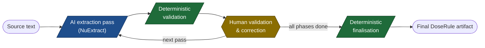

# DoseRules Extraction Flowchart

## 1. Purpose

Per-generic FTK XML → `DoseRuleData` TSV via three sequential **NuExtract Online** passes plus a fourth **pure post-processing** pass, with a **human validation/edit checkpoint** after each pass. Each pass writes a TSV (and optionally uploads it as a Google Sheet); the user edits the file, and the next pass reads the edited version. Pass 3 is the terminal LLM-driven pass and emits the canonical TSV with structured PC, Component / Substance, and DoseLimit columns filled. Pass 4 is a deterministic post-processing pass that fills the `Id` / `GrpId` / `SortNo` columns from a stable hash of the canonical key fields — no NuExtract spend.

The whole pipeline lives in `src/Informedica.NLP.Lib/Scratch/ftk_extract_v2.fsx` — single self-contained script with all phase modules, NuExtract HTTP plumbing, Drive helpers, the FTK XML reader / decomposer, and the TSV writer. NuExtract 2.0's `verbatim-string` typing keeps Dutch source text intact across the round-trip; raw FTK XML is fed directly to NuExtract (no curation in front).

### Pipeline at a glance



Each AI pass extends the artifact one level deeper; each human step refines what the prior pass produced. The cycle repeats per phase until all levels are populated, then a deterministic pass assigns stable identifiers.

Legend: blue = AI extraction, yellow = human validation/correction, green = deterministic post-process.

## 2. Scope assumptions

1. **Input**: the `<doseringen>` section of one generic's FTK preparaattekst XML, decomposed by `Ftk.decompose` / `Ftk.decomposeFromGeneric` and passed directly to NuExtract — no curation in front. Other formularies plug in by reusing the same decomposed-Block shape.
2. **Output of Pass 3**: one row per `(generic, indication, route, patient category, doseType, doseText, component, substance)` tuple, with PC + DoseLimit numerics and units filled in place. **Output of Pass 4**: same row set with `Id`, `GrpId`, `SortNo` filled by deterministic hash + ranking.
3. **The TSV file is the validation gate.** Each `Ux` step is a manual human pass — no in-app UI, no automated diff between passes. The user edits rows freely (add / delete / modify / reorder).
4. `Brand`, `Form`, `GPKs` (specific-dose-rule identifiers) are filled by the user at **U1**, right after Pass 1; all three enter the GrpId hash. `Dep` (department) is part of L4 PatientCategory and is also filled at U1 where applicable (optional — may stay empty). `Component` / `Substance` are filled by deterministic preprocessing inside Phase 3, driven by the user-edited `CmpBased` column — not by the model (see §6.3).
5. **NuExtract instructions** live as markdown under `docs/data-extraction/instructions/` and are loaded eagerly at script-load time. Edit-and-reload picks up changes.

## 3. Hierarchical data model

Every TSV row in the pipeline materialises one full path through a strict hierarchy of facts about a drug. Each pass extends the tree one level deeper; each user step refines the level the previous pass populated. Pass 4 hashes prefixes of the path to assign stable identifiers.

```text
L0  Source                                — formulary identifier (FTK, NKF, ...)
└── L1  Generic                           — canonical drug name
    │   ▷ Product axes (specific dose-rule identifiers, filled at U1):
    │       Form, Brand, GPKs
    └── L2  Indication                    — clinical indication
        └── L3  Route                     — administration route
            └── L4  PatientCategory       — verbatim PatientText + structured
                │                            (Gender, IsAdult, MinAge / MaxAge,
                │                             Weight, BSA, GestAge, PMAge,
                │                             Dep — user-derived department,
                │                             optional, may stay empty)
                └── L5  DosePhase         — DoseType + DoseText + per-phase ScheduleText slice
                    └── L6  DoseTarget    — granularity selector:
                        │                    Component-based OR Substance-based
                        └── L7  DoseLimit — numeric ranges + units
                                              (Freqs, MinQty / MaxQty,
                                               MinPerTime / MaxPerTime,
                                               MinRate / MaxRate, ...)
```

**Product axes** (`Form`, `Brand`, `GPKs`) sit alongside L1 Generic and identify the specific drug product the dose rule applies to. They are filled by the user at U1 (right after Pass 1) so every downstream pass already sees the final dose-rule identity. All three enter the GrpId hash (see §3.2).

**`Dep` (department)** is a user-derived attribute of L4 PatientCategory, captured at U1 alongside the verbatim `PatientText` refinement. It can be left empty and is **spec'd** to enter the GrpId hash with the rest of L4(structured) — see the spec/code drift note in §3.2.

### 3.1 Levels and key axes

Each level is populated by a sequence of alternating **S** (system: deterministic code or NuExtract call) and **U** (user: manual TSV edit at a validation gate) actions across the pipeline. Rows are ordered by **pipeline step** first, then by level. The `#` column gives the global sequence.

Pipeline steps in order: Pass 1 → U1 → Pass 2 → U2 → Pass 3 (fan-out) → Pass 3 (PC sub-call) → Pass 3 (Limits sub-call) → U3 → Pass 4 → U4. Product axes (`Form` / `Brand` / `GPKs`) and the `Dep` axis at L4 are filled at U1; there is no separate "Manual refinement" step.

| # | Step | Actor | Level | Action | TSV columns affected | Driver |
|---|---|---|---|---|---|---|
| 1 | Pass 1 | S | L0 Source | Stamp `Source` from input metadata (literal `FTK` today). | `Source` | Pass 1 (input metadata) |
| 2 | Pass 1 | S | L1 Generic | Stamp `Generic` from input metadata. | `Generic` | Pass 1 (input metadata) |
| 3 | Pass 1 | S | L2 Indication | Extract verbatim Dutch indication phrase. | `Indication` | Pass 1 NuExtract |
| 4 | Pass 1 | S | L3 Route | Extract route, canonicalise to enum (`ORAAL`, `INTRAVENEUS`, …); apply default-Oraal post-process. | `Route` | Pass 1 NuExtract + `PostProcess.defaultOralRoute` |
| 5 | Pass 1 | S | L4 PatientCategory | Fill verbatim Dutch `PatientText`; stamp preliminary `IsAdult` via a regex / keyword classifier on `PatientText` (today: `isAdultByKeyword` matching `volwassen` / `ouderen` / `bejaarden`; the classifier is intended to grow into a broader regex set or a NuExtract-driven extractor). | `PatientText`, `IsAdult` (preliminary) | Pass 1 NuExtract + `Tsv.isAdultByKeyword` |
| 6 | Pass 1 | S | L5 DosePhase | Fill verbatim Dutch `ScheduleText`. | `ScheduleText` | Pass 1 NuExtract |
| 6a | Pass 1 | S | (synthesised) | Compose `OriginalText` from `PatientText` + `ScheduleText` (`PatientText: ScheduleText` join). | `OriginalText` | `Tsv.composeOriginalText` |
| 7 | U1 | U | L2 Indication | Split / correct indication cells if needed. | `Indication` | manual TSV edit |
| 8 | U1 | U | L3 Route | Correct misclassified routes. | `Route` | manual TSV edit |
| 9 | U1 | U | L4 PatientCategory | Split coarse `PatientText` cells into finer rows. | `PatientText` | manual TSV edit |
| 10 | U1 | U | L4 PatientCategory | Set `Dep` (department) where applicable. Optional — leave empty when not relevant. | `Dep` | manual TSV edit |
| 11 | U1 | U | L5 DosePhase | Split coarse `ScheduleText` cells into finer rows. | `ScheduleText` | manual TSV edit |
| 12 | U1 | U | Product axes (alongside L1) | Identify the specific dose rule by filling `Form`, `Brand`, `GPKs`. All three enter the GrpId hash. | `Form`, `Brand`, `GPKs` | manual TSV edit |
| 13 | Pass 2 | S | L5 DosePhase | Phase split: 1 row → M phases; overwrite `ScheduleText` with the per-phase slice. | `DoseType`, `DoseText`, `ScheduleText` | Pass 2 NuExtract |
| 14 | U2 | U | L5 DosePhase | Correct phases. | `DoseType`, `DoseText`, `ScheduleText` | manual TSV edit |
| 15 | U2 | U | L6 DoseTarget | Mark `CmpBased` (component-based) or leave empty (substance-based). | `CmpBased` | manual TSV edit |
| 16 | Pass 3 — fan-out | S | L6 DoseTarget | Fan-out 1 row → N expansions; fill `Component` / `Substance`. | `Component`, `Substance` | `Phase3.expandRowsByGranularity` |
| 17 | Pass 3 — PC sub-call | S | L4 PatientCategory | Extract structured PC fields (incl. authoritative `IsAdult` verdict from the model); cached by `(Generic, PatientText)`. The final `IsAdult` cell is then resolved by `Phase3Pure.resolveIsAdultCell` from numeric age bounds → model verdict → preliminary keyword cell. | `Gender`, `IsAdult`, `MinAge`/`MaxAge`, `MinWeight`/`MaxWeight`, `MinBSA`/`MaxBSA`, `MinGestAge`/`MaxGestAge`, `MinPMAge`/`MaxPMAge` | Pass 3 PC NuExtract sub-call + `resolveIsAdultCell` |
| 18 | Pass 3 — Limits sub-call | S | L7 DoseLimit | Extract numerics + units (LimitsKind-dispatched); apply `validateMinMax`, AdjustUnit-pairing guard, `extractedFor` self-check. | `DoseUnit`, `AdjustUnit`, `RateUnit`, `Freqs`, `FreqUnit`, `MinTime`/`MaxTime` + `TimeUnit`, `MinInt`/`MaxInt` + `IntUnit`, `MinDur`/`MaxDur` + `DurUnit`, `MinQty`/`MaxQty`, `MinQtyAdj`/`MaxQtyAdj`, `MinPerTime`/`MaxPerTime`, `MinPerTimeAdj`/`MaxPerTimeAdj`, `MinRate`/`MaxRate`, `MinRateAdj`/`MaxRateAdj` | Pass 3 Limits NuExtract sub-call |
| 19 | U3 | U | L4 PatientCategory | Validate / correct structured PC fields **except `IsAdult`** (system-resolved at step 17 — see **IsAdult policy** below). | `Gender`, `MinAge`/`MaxAge`, `MinWeight`/`MaxWeight`, `MinBSA`/`MaxBSA`, `MinGestAge`/`MaxGestAge`, `MinPMAge`/`MaxPMAge` | manual TSV edit |
| 20 | U3 | U | L7 DoseLimit | Validate / correct numerics + units. | as step 18 | manual TSV edit |
| 21 | Pass 4 | S | Identity | Assign `Id` / `GrpId` / `SortNo` (deterministic SHA1-12 + rank); no NuExtract spend. | `Id`, `GrpId`, `SortNo` | Pass 4 (`Phase4Pure.assignIds`) |
| 22 | U4 | U | Identity | Final review of the TSV before CONV. | — | manual TSV edit |

> **IsAdult policy (spec).** `IsAdult` is **fully system-resolved** — never a U3 user task. Two system signals feed the final value: (i) a regex / keyword classifier over `PatientText` at Pass 1 (current implementation: `Tsv.isAdultByKeyword`; future: broader regex set or an additional NuExtract field), and (ii) the model's `isAdult` verdict from the Pass 3 PC sub-call together with the structured age bounds. `Phase3Pure.resolveIsAdultCell` combines them with priority `numeric age bounds (≥ 6570 days = adult) → model verdict → preliminary keyword cell`. Operators can still override the cell as a last resort during U3, but the spec contract is that no manual override should be needed.

### 3.2 Identity keys (Pass 4)

Pass 4 hashes two **prefixes of the path through the tree**, plus the product axes that identify the specific dose rule:

- **GrpId** = SHA1-12 over L0..L4(structured) + product axes:
  `Source · Generic · Form · Brand · Route · GPKsCanon · Indication · Gender · IsAdult · MinAge · MaxAge · MinWeight · MaxWeight · MinBSA · MaxBSA · MinGestAge · MaxGestAge · MinPMAge · MaxPMAge · Dep`
- **Id** = SHA1-12 over the GrpId fields ++ L5: `… · DoseType · DoseText`

> **Spec/code drift — `Dep`.** `Dep` is part of L4 PatientCategory and is therefore included in the GrpId key in this spec. The current `Phase4Pure.buildGrpFields` implementation does **not** include `Dep` (the field list ends at `MaxPMAge`). This is a known gap: rows that share the entire L0..L4(non-Dep) prefix but differ only in `Dep` will currently collide on GrpId. Reconciliation requires adding `Dep` to `buildGrpFields` and re-running Phase 4 on affected TSVs.

L6 DoseTarget (`Component`, `Substance`) is **intentionally excluded from Id**. Multi-substance fan-outs of one logical rule (rows that differ only at L6) share a single Id, GrpId, and SortNo. L7 DoseLimit numerics are excluded too — they are downstream consequences of the rule, not part of its identity.

`SortNo` ranks distinct Ids inside one GrpId by `(doseTypePriority DoseType, originalRowIndex)`, where priority is `once → onceTimed → discontinuous → timed → continuous → unfinished`. Rows that share an Id share a SortNo.

### 3.3 Cardinality at each pipeline boundary

| Boundary | Cardinality | Driver |
|---|---|---|
| Source XML → L0..L4(verbatim) + L5(verbatim ScheduleText) | 1 doc → N rows | Pass 1 (`Phase1.extractToTsv`) |
| L4(verbatim) / L5(verbatim) → refined splits | N → N′ | U1 (manual) |
| L5(verbatim) → L5(per-phase slice + DoseType + DoseText) | 1 row → M rows | Pass 2 (`Phase2.extractToTsv`) |
| L5 → L5(refined) + `CmpBased` | M → M′ | U2 (manual) |
| L5 + `CmpBased` → L6 expansions | M′ → P rows | `Phase3.expandRowsByGranularity` (deterministic, no NuExtract) |
| L4(verbatim) → L4(structured) | shared across L5/L6 (cached by `(Generic, PatientText)`) | Pass 3 PC sub-call |
| L6 → L7 | P → P (one Limits emit per expansion) | Pass 3 Limits sub-call |
| L4(structured) / L7 → validated | P → P′ | U3 (manual) |
| L0..L5 → GrpId, Id, SortNo | P′ → P′ (no row count change) | Pass 4 (pure) |

### 3.4 Mapping to TSV columns

Each TSV row materialises one full L0..L7 path. Cells belonging to a level not yet populated by the current pass are blank; cells that the user must supply (`Form`, `Brand`, `GPKs` at U1; `Dep` at U1 if applicable; `CmpBased` at U2) stay blank until the corresponding user step. `Dep` may also stay empty when the source rule has no department scope. The "TSV columns filled" / "still blank after Px" rows in §6 are the column-level projection of this hierarchical view.

## 4. Pipeline shape

```text
FTK preparaattekst XML — <doseringen> section (one generic)
   │
   ▼
[Pass 1: NuExtract Online — verbatim record extraction]   §6.P1
   │
   ▼   write <generic>_pass1.tsv (+ optional Drive upload)
[User validates pass1: split L2..L5 verbatim cells; fill `Form` / `Brand` / `GPKs` (specific dose-rule identifiers); set `Dep` (optional, part of L4 PatientCategory)]
   │
   ▼
[Pass 2: NuExtract Online — DoseType split]               §6.P2
   │
   ▼   write <generic>_pass2.tsv (1 row → M phase rows)
[User validates + possible additional dose schedule text splits + determine component based pass2]
   │
   ▼
[Pass 3: granularity preprocessing + 10-project NuExtract dispatch] §6.P3
   │   (CmpBased preprocessing fans out 1 phase row → N expansions;
   │    Per row: PC + ScheduleForm classifier (disc/timed only) + dose-type-specific Limits;
   │    PC sub-call cached by (Generic, PatientText);
   │    ScheduleForm sub-call cached by (Generic, ScheduleText);
   │    Limits sub-call cached by (Generic, ScheduleText, SubstanceHint, LimitsKind)
   │    — substance hint is in the key so compact multi-substance shorthand
   │    (e.g. "1000/100-2000/200 mg/dosis" for amoxi/clavulaan) yields
   │    per-substance numerics, hinted via a "Substance: <name>" prefix;
   │    LimitsKind picks one of 7 per-DoseType limits templates plus a CatchAll
   │    fallback for `unfinished` rows. Each limits template emits a
   │    self-declared `extractedFor` label that the driver cross-checks
   │    against the substance hint — mismatches log audit failures.)
   │
   ▼   write <generic>_pass3.tsv (1 phase row → N expansions per CmpBased)
[User validates pass3 — terminal LLM-driven artefact]
   │
   ▼
[Pass 4: assign Id / GrpId / SortNo (pure post-processing)]   §6.P4
   │   (no NuExtract spend; deterministic short-hash IDs over
   │    Source + Generic + Form + Brand + Route + GPKs + Indication
   │    + structured PatientCategory (incl. IsAdult) + DoseType + DoseText
   │    for Id; same key minus DoseType/DoseText for GrpId.
   │    SortNo ranks unique Ids per GrpId by DoseType priority,
   │    tiebreaker = original Pass-3 row order.
   │    Multi-substance fan-outs of one logical rule share Id, GrpId, SortNo.)
   │
   ▼   write <generic>_pass4.tsv (1 row in → 1 row out, IDs filled)
[User validates pass4 — final TSV before CONV]
   │
   ▼
[Downstream CONV — TBD]   §8
   │
   ▼
[GenFORM ingest]
```

Pass shape: **NuExtract Online call → fill / fan out TSV columns → write to disk → optional Drive upload → human edit → next pass reads the edited file**.

Column set is the live `DoseRules` Google Sheet header (currently includes `PatientText` and `CmpBased` as input columns to Pass 3; both are dropped by CONV before the production `doserules.tsv` emit). See §7.

## 5. Flowchart

```mermaid
%%{init: {'theme': 'neutral'}}%%
flowchart TD
    CTX_IN(["Input: FTK preparaattekst XML<br/>&lt;doseringen&gt; section, one generic"])
    CTX_IN --> P1

    %% Pass 1 — verbatim record extraction
    P1["P1  NuExtract Online: flat V2 template<br/>indication / route / patientCategory / doseSchedule<br/>verbatim-string fields"]
    P1 -->|"N rows per doc"| T1["T1  Write &lt;generic&gt;_pass1.tsv<br/>fills Source=FTK, Generic, Route, Indication,<br/>PatientText, ScheduleText"]
    T1 --> U1{"U1  User validates pass1<br/>split L2..L5 verbatim cells;<br/>fill Form / Brand / GPKs (specific dose-rule);<br/>set Dep (optional, part of L4 PatientCategory)<br/>disk or Drive Sheet"}

    %% Pass 2 — DoseType split
    U1 --> P2["P2  NuExtract Online on ScheduleText<br/>→ DoseType + DoseText per-phase slice<br/>1 input row → M output rows"]
    P2 -->|"fan-out: M rows per input row"| T2["T2  Write &lt;generic&gt;_pass2.tsv<br/>fills DoseType, DoseText;<br/>ScheduleText = per-phase slice"]
    T2 --> U2{"U2  User validates pass2<br/>fills CmpBased per row"}

    %% Pass 3 — combined PC + ScheduleForm + per-DoseType DoseLimits, granularity from CmpBased
    U2 --> PRE["PRE  Phase3.expandRowsByGranularity<br/>CmpBased=x ⇒ component-based: 1 row, Substance=&quot;&quot;<br/>CmpBased=&quot;&quot; ⇒ substance-based: split Generic on /,<br/>1 row per substance (mono ⇒ Substance=Generic)"]
    PRE -->|"1 input row → N expansions"| P3["P3  Three NuExtract sub-calls (cached) per row<br/>a) PC template on PatientText, cached by (Generic, PatientText)<br/>b) ScheduleForm classifier on ScheduleText (only when DoseType ∈ {discontinuous, timed}),<br/>cached by (Generic, ScheduleText) → frequency / interval / mixed / none<br/>c) Limits template chosen by Phase3Pure.limitsKindOf (DoseType, ScheduleForm)<br/>→ once / onceTimed / discFreq / discInt / timedFreq / timedInt /<br/>continuous / catchAll (each emits a focused field subset)<br/>cached by (Generic, ScheduleText, SubstanceHint, LimitsKind)<br/>multi-substance fan-outs prepend 'Substance: name' hint;<br/>each template emits self-declared 'extractedFor' label;<br/>extractLimitElement + runLimitsCall guards<br/>(validateMinMax + AdjustUnit pairing + extractedFor self-check)<br/>repair common model errors before the row is written."]
    P3 --> T3["T3  Write &lt;generic&gt;_pass3.tsv<br/>union of DoseLimitFields columns;<br/>per-LimitsKind templates leave non-applicable cells blank<br/>(e.g. once row has no Freqs/Time/Int/Rate)"]
    T3 --> U3{"U3  User validates pass3<br/>terminal artifact"}

    %% Pass 4 — Id / GrpId / SortNo assignment (pure)
    U3 --> P4["P4  Phase4Pure.assignIds (no NuExtract spend)<br/>Id    = sha1Short(Source + Generic + Form + Brand + Route + GPKs<br/>                  + Indication + PatientCategory(structured, incl. IsAdult + Dep)<br/>                  + DoseType + DoseText) [12 hex]<br/>GrpId = sha1Short(same key minus DoseType/DoseText) [12 hex]<br/>(spec/code drift: Dep not yet hashed by buildGrpFields — see §3.2)<br/>SortNo ranks unique Ids per GrpId by DoseType priority<br/>(once → onceTimed → discontinuous → timed → continuous → unfinished),<br/>tiebreaker = original Pass-3 row order;<br/>multi-substance fan-outs share Id, GrpId, SortNo."]
    P4 --> T4["T4  Write &lt;generic&gt;_pass4.tsv<br/>fills Id, GrpId, SortNo;<br/>all other columns pass through verbatim"]
    T4 --> U4{"U4  User validates pass4<br/>final TSV before CONV"}

    %% Downstream CONV (TBD)
    U4 --> CONV["TBD — Primitive validation + canonical 51-col emit<br/>elevate string → Gender DU,<br/>string → Units.*, float → BigRational;<br/>drop intermediate PatientText column"]
    CONV --> GF["GenFORM ingest"]
```



## 6. Pass schemas

Every pass calls NuExtract Online via the shared HTTP plumbing in `module NuExtract` of `src/Informedica.NLP.Lib/Scratch/ftk_extract_v2.fsx` (`createProject` + `extractText` + `deleteProject`, Bearer auth from `NUEXTRACT_API_KEY`). Per-call payloads are sent **unchunked**. Verbatim-typed fields are used wherever possible so Dutch source text is preserved verbatim across the round-trip; numeric fields are typed `number` / `integer` and converted to canonical units client-side.

### 6.1 Pass 1 — verbatim record extraction (fills L0..L4 verbatim + L5 ScheduleText)

| | |
|---|---|
| **Status** | Live |
| **Template** | `Schema.nuExtractFlatTemplate` — `{"doses": [{"indication": "verbatim-string", "route": "verbatim-string", "patientCategory": "verbatim-string", "doseSchedule": "verbatim-string"}]}` |
| **Instructions** | `docs/data-extraction/instructions/phase1-ftk.md` (loaded eagerly via `Schema.ftkInstructions`) |
| **Driver** | `Phase1.extractToTsv` (gated on `FTK_EXTRACT_RUN=1`); single project per run |
| **Input** | The `<doseringen>` section of the FTK preparaattekst XML for one generic — passed directly to NuExtract; no curation, no normalisation |
| **Output** | An array of records `(indication, route, patientCategory, doseSchedule)` |
| **Cardinality** | 1 doc → N rows |
| **TSV columns filled** | `Source` (literal `"FTK"`), `Generic` (input metadata), `Route`, `Indication`, `PatientText` (verbatim Dutch PC), `ScheduleText` (verbatim Dutch dose-schedule), `OriginalText` (`PatientText: ScheduleText` join via `Tsv.composeOriginalText`), `IsAdult` (preliminary keyword heuristic via `Tsv.isAdultByKeyword` — `"x"` when `PatientText` starts with `volwassen`/`ouderen`/`bejaarden`, else `""`; later refined by Pass 3's `resolveIsAdultCell`) |
| **TSV columns blank** | All structured PC numeric columns (`Gender`, `MinAge` / `MaxAge`, weight, BSA, gestAge, PMAge), `DoseType`, `DoseText`, `Component`, `Substance`, `CmpBased`, all numeric limit columns, all unit columns, `Brand`, `Form`, `GPKs`, `Dep`, `Id`, `GrpId`, `SortNo` |

### 6.2 Pass 2 — DoseType split (slices L5 verbatim into M DosePhases)

| | |
|---|---|
| **Status** | Live |
| **Template** | `Schema.nuExtractDoseTypeTemplate` — `{"phases": [{"doseType": "verbatim-string", "doseText": "verbatim-string", "text": "verbatim-string"}]}` |
| **Instructions** | `docs/data-extraction/instructions/phase2-dose-type.md` (loaded via `Schema.doseTypeInstructions`) |
| **Driver** | `Phase2.extractFromDisk` / `Phase2.extractFromDrive` / `Phase2.upload`; single project per run; one HTTP call per Pass-1 row |
| **Input** | Each row's `ScheduleText` column from `<generic>_pass1.tsv` |
| **Output** | An array of `(doseType, doseText, text)` per input row. `doseType` is canonicalised client-side against `{once, onceTimed, discontinuous, timed, continuous}`; unknown tokens fold to `"unfinished"` (`Phase2.canonicalizeDoseType`) |
| **Cardinality** | 1 input row → M output rows (fan-out: one row per dose phase). When NuExtract returns zero phases for a non-empty `ScheduleText`, `Phase2Pure.synthesisePhases` emits M = 1 with `doseType = "unfinished"`, `doseText = ""`, `ScheduleText` unchanged. Empty `ScheduleText` rows are still emitted with M = 1 — a single placeholder phase with `DoseType = ""`, `DoseText = ""`, and an empty `ScheduleText` slice (cell value remains empty); no NuExtract call is made for these rows. |
| **TSV columns filled** | `DoseType`, `DoseText`. The verbatim per-phase slice `text` overwrites the `ScheduleText` column on the fanned-out row so subsequent dose-limit extraction operates on the per-phase text only. |
| **TSV columns blank after P2** | All structured PC numeric columns, `Component`, `Substance`, all numeric limit columns, all unit columns, `Id`, `GrpId`, `SortNo`. `Brand` / `Form` / `GPKs` are expected to be filled at U1 (specific-dose-rule identifiers); `Dep` is expected to be filled at U1 where applicable, otherwise intentionally empty. |

### 6.3 Pass 3 — PatientCategory (L4 structured) + DoseTarget expansion (L6) + DoseLimits (L7) — CmpBased-driven granularity, LimitsKind-dispatched per DoseType + ScheduleForm

| | |
|---|---|
| **Status** | Live |
| **Templates** | `Schema.pcTemplate` (17 fields — `gender`, `isAdult`, plus Min/Max + unit triples for age / weight / BSA / gestAge / PMAge); `Schema.scheduleFormTemplate` (1 enum field — `frequency` / `interval` / `mixed` / `none`); 7 per-LimitsKind limits templates (`onceTemplate` 7 fields, `onceTimedTemplate` 10, `discFreqTemplate` 16, `discIntTemplate` 19, `timedFreqTemplate` 19, `timedIntTemplate` 22, `continuousTemplate` 11) plus the legacy `limitsTemplate` (27 fields, used only as the `CatchAll` fallback for `unfinished` and unrecognised DoseType). Every limits template carries `extractedFor` as its FIRST field (verbatim-string self-declared label: the hinted substance name when a `Substance: <name>` header is present, or `"Form"` when no header) — see the **`extractedFor` self-check** row below. All template field counts derive their categorical-unit enums from the live `DoseRules` Google Sheet via the shared `Schema.unitField` / `Schema.doseRulesSheet` helpers (one HTTP GET at script-load, snapshot reused). |
| **Instructions** | `phase3-patient-category.md` (`Schema.pcInstructions`); `phase3-schedule-form.md` (`Schema.scheduleFormInstructions`); per-LimitsKind prompts `phase3-dose-limits-once.md`, `-once-timed.md`, `-disc-freq.md`, `-disc-int.md`, `-timed-freq.md`, `-timed-int.md`, `-continuous.md` (all loaded via `Schema.<kind>Instructions`); legacy `phase3-dose-limits.md` (`Schema.limitsInstructions`, the CatchAll prompt). All substance-aware prompts share a uniform SUBSTANCE-HINT block: inline-name takes precedence over ratio-shorthand, and a hint that does not match a numeric's owner forces `null` for that numeric (no copy-across-substances). |
| **Driver** | `Phase3.extractFromDisk` / `Phase3.extractFromDrive` / `Phase3.upload`. **10 NuExtract projects created upfront** (PC, ScheduleForm, 7 per-LimitsKind limits, CatchAll) via the `Project.withProjects` combinator (built from `Phase3.projectSpecs runStamp`), which threads creation, the orchestrator body, and best-effort cleanup of every successfully-created project through one `try / finally`. Per-row fanout runs under `AsyncThrottle.parallelThrottled` (degree from `FTK_EXTRACT_PARALLEL`, default 8). |
| **Granularity preprocessing** | `Phase3.expandRowsByGranularity` runs before any NuExtract call. Per Pass-2 row: non-empty `CmpBased` ⇒ ONE expansion with `Component = Generic`, `Substance = ""`. Empty `CmpBased` ⇒ split `Generic` on `'/'` (trim, drop empties), ONE expansion per segment with `Component = Generic`, `Substance = <segment>`. Mono-substance generics yield ONE expansion with `Component = Substance = Generic`. Required Pass-2 columns include `DoseType` (read by `limitsKindOf`) — fails fast otherwise. |
| **PC sub-call** | Input: `PatientText`. Output: PC numerics + verbatim Dutch units; min and max of each pair share one unit (UNIT INVARIANT). Code-side converts to canonical days / grams / m² via `convertAgePairToDays` / `convertWeightPairToGrams` / `convertBsaPairToM2`. Cached by `(Generic, PatientText)`. |
| **ScheduleForm sub-call** | `Phase3.runScheduleFormCall` invoked **only when DoseType ∈ {`discontinuous`, `timed`}**; other DoseTypes bypass the classifier (form passed as `None`). Output: a single `scheduleForm` enum, parsed by `Phase3Pure.parseScheduleForm` to a `ScheduleForm` DU (`Frequency` / `Interval` / `Mixed` / `None_`); transport / parse failures default to `Frequency` so the row still gets extracted by the broadest template. Cached by `(Generic, ScheduleText)` — classification is LimitsKind-independent and substance-agnostic. |
| **Routing matrix (`Phase3Pure.limitsKindOf`)** | `once` → `Once`; `onceTimed` → `OnceTimed`; `continuous` → `Continuous`; `discontinuous` + `Frequency` / `Mixed` / `None_` → `DiscFreq`; `discontinuous` + `Interval` → `DiscInt`; `timed` + `Frequency` / `Mixed` / `None_` → `TimedFreq`; `timed` + `Interval` → `TimedInt`; any other DoseType (incl. `unfinished`) → `CatchAll`. `Mixed` and `None_` fall back to the frequency-form template because it captures BOTH `freqs` / `freqUnit` and `minInt` / `maxInt` / `intUnit`. The lower-camel label of a `LimitsKind` (`once`, `onceTimed`, `discFreq`, …) is produced by `Phase3Pure.labelOfKind` and used in audit JSON; the Pascal-case label (`Once`, `OnceTimed`, `DiscFreq`, …) is produced by `Phase3.labelForKind` and used as the project-map key. |
| **Limits sub-call** | `Phase3.runLimitsCall projectId substance scheduleText` (the second parameter is named `substance` in code but always carries the resolved substance hint) where `projectId = projectIds.ByKind kind` (the resolved kind from `limitsKindOf`). The substance hint is computed once via `Phase3Pure.resolveSubstanceHint generic substance` (empty when the substance equals the generic or is missing). Input: per-phase `ScheduleText`, optionally prefixed with `Substance: <name>\n---\n` (built by `Phase3Pure.buildLimitsPayload`); omitted for component-based and single-substance rows. Output: a single object whose field set depends on the LimitsKind. Numerics validated by `Phase3Pure.validateMinMax` (inverted pairs swap, negatives drop); units canonicalised against `Phase3Pure.canonical{Genders,DoseUnits,AdjustUnits,TimeUnits}` (unknown tokens fall through verbatim — required for sheet-only units like `AXa.E`/`mmol` and composite freq intervals like `"36 uur"`). `freqs` is parsed from a verbatim Dutch phrase by `Phase3Pure.parseFreqs`, then unioned with integer frequencies extracted from the schedule text by `Phase3Pure.augmentFreqsFromSchedule` (regex-driven: matches `N×/`, `N x /`, ranges expand). **AdjustUnit pairing guard**: if `AdjustUnit` is non-empty but every adjusted-dose numeric is None, `AdjustUnit` is cleared and a failure note is appended (defends against the common model bias of tagging `kg` reflexively when patient-context mentions weight). **`extractedFor` self-check guard** (`Phase3Pure.checkExtractedFor`): the model's self-declared `extractedFor` label is compared (case-insensitive) against the substance hint passed in the call — when the hint is empty, `extractedFor` MUST be `"Form"`; when the hint is non-empty, `extractedFor` MUST match it verbatim. Mismatches do NOT mutate the numerics — they only log a failure note so the operator can triage from the audit JSON; the row still gets written. Cached by `(Generic, ScheduleText, SubstanceHint, LimitsKind)` — LimitsKind is in the key because the same `(generic, scheduleText, substanceHint)` tuple can produce different field shapes through different per-LimitsKind prompts. |
| **Cardinality** | 1 Pass-2 row → N output rows where N = expansions produced by `expandRowsByGranularity`. Empty `ScheduleText` still expands per `CmpBased`; Limits cells stay blank. |
| **TSV columns filled** | All structured PC columns (`Gender`, `IsAdult` (when present), `MinAge` / `MaxAge`, weight, BSA, gestAge, PMAge), `Component`, `Substance`, all unit columns, `Freqs`, every `Min*` / `Max*` numeric — but only the subset that the chosen LimitsKind's template actually emits; non-applicable cells stay blank (e.g. an `Once` row leaves `Freqs` / `FreqUnit` / `MinTime` / `MinInt` / `MinRate` etc. empty). `IsAdult` is resolved by `Phase3Pure.resolveIsAdultCell` (numeric verdict from `MinAgeDays ≥ 6570` first, then the model's `isAdult` field, else the existing keyword cell from Pass 1). |
| **TSV columns still blank after P3** | `Id`, `GrpId`, `SortNo` (filled by Pass 4). `Brand` / `Form` / `GPKs` and (where applicable) `Dep` are expected to have been filled at U1; the spec contract is that no new manual refinement is required between U3 and Pass 4. |

### 6.4 Pass 4 — Id / GrpId / SortNo assignment (hashes prefixes of the L0..L5 path)

| | |
|---|---|
| **Status** | Live |
| **Driver** | `Phase4.extractFromDisk` / `Phase4.extractFromDrive` / `Phase4.upload`. Pure post-processing — no NuExtract calls, no NUEXTRACT_API_KEY required. |
| **Input** | `<generic>_pass3.tsv` (or the latest `<generic>_pass3` Drive Sheet). |
| **Output** | `<generic>_pass4.tsv` with `Id`, `GrpId`, `SortNo` filled; all other columns pass through verbatim. |
| **Cardinality** | 1 input row → 1 output row. |
| **GrpId key** (spec) | `Source + Generic + Form + Brand + Route + GPKsCanon + Indication + Gender + IsAdult + MinAge + MaxAge + MinWeight + MaxWeight + MinBSA + MaxBSA + MinGestAge + MaxGestAge + MinPMAge + MaxPMAge + Dep`. Each field passes through `Phase4Pure.normaliseField` (trim, drop tabs/newlines, collapse whitespace, lowercase); `GPKs` first goes through `normaliseGpks` (split on `,`/`;`, trim, sort, rejoin). `IsAdult` is **optional** in the input — older Pass-3 TSVs that predate the column treat the slot as empty. **Spec/code drift:** the current `Phase4Pure.buildGrpFields` does not yet include `Dep`; see §3.2 for the reconciliation note. |
| **Id key** | GrpId key concatenated with `DoseType` and `DoseText`. Substance / Component are intentionally excluded — multi-substance fan-outs of one logical rule (e.g. amoxicilline + clavulaanzuur for the same PC and DoseType) share one Id; Substance just identifies which `SubstanceLimit` they populate. |
| **Hash** | SHA-1 over the tab-joined normalised key, first 6 bytes rendered as 12 lowercase hex chars (~16M before 50% birthday collision; well over the FTK + NKF + future-formularies row count). |
| **SortNo** | Ranks **unique Ids** within each GrpId by `(doseTypePriority DoseType, originalRowIndex)`, where priority is `once → onceTimed → discontinuous → timed → continuous → unfinished`. Rows that share an Id (multi-substance fan-outs) share a SortNo. |
| **TSV columns filled** | `Id`, `GrpId`, `SortNo`. |
| **TSV columns still blank after P4** | None mandatorily blank — `Brand` / `Form` / `GPKs` were filled at U1, structured PC at Pass 3, identifiers at Pass 4. `Dep` may remain empty when the source rule has no department scope. |
| **Idempotency** | Re-running Phase 4 on a Pass-4 TSV is byte-identical to the first run **provided the GrpId / Id key cells are unchanged** (`Source`, `Generic`, `Form`, `Brand`, `Route`, `GPKs`, `Indication`, structured PatientCategory incl. `Dep`, `DoseType`, `DoseText`). User-driven refinements that touch any of those cells between runs will produce different hashes — by design. With `Form` / `Brand` / `GPKs` / `Dep` now filled at U1, the typical flow stabilises hashes by Pass 4 first run. |
| **Audit JSON** | `<jsonDir>/<generic>.pass4.json` — one entry per row carrying `inputRowIndex`, `id`, `grpId`, `sortNo`, `doseType`, `grpFields[]`, `idFields[]`, `generic`. Lets a human reproduce any hash by hand. |

### 6.5 Verbatim invariant

Each pass's text output is a strict substring of the previous pass's output (and ultimately of the original `<doseringen>` text). Client-side touches content only via unit canonicalisation and numeric conversion (days / grams / m²); the original Dutch tokens are recoverable from the per-generic audit JSON.

## 7. TSV checkpoint format

Column set is the live `DoseRules` Google Sheet header (read at script-load time by `Tsv.canonicalColumns`). Three columns are extraction-only inputs (filled by Pass 1 / 2 from NuExtract output or by the user, then dropped by CONV before the production `doserules.tsv` emit):

- **`PatientText`** — verbatim Dutch PC text. Filled by Pass 1, read by Pass 3's PC sub-call.
- **`ScheduleText`** — verbatim Dutch dose-schedule. Filled by Pass 1, overwritten by Pass 2 with the per-phase slice, read by Pass 3's ScheduleForm + Limits sub-calls.
- **`CmpBased`** — granularity flag. Emitted blank by Pass 1 / 2, **filled by the user during U2** (typically `"x"` for component-based, empty for substance-based). Phase 3 reads it to fan out rows; missing column ⇒ fails fast with `required column 'CmpBased' not in Pass-2 TSV header`.

User-filled product axes (`Form`, `Brand`, `GPKs`) are filled at **U1**, right after Pass 1, because they identify the specific dose rule and feed the GrpId hash. `Dep` (department) is part of L4 PatientCategory, also filled at U1 where applicable; it can be left empty when the source rule has no department scope.

`DoseType` is a Phase-2 output (canonical enum `once` / `onceTimed` / `discontinuous` / `timed` / `continuous` / `unfinished`) that is **also a Pass-3 required column**: read by `Phase3Pure.limitsKindOf` to dispatch each row to the matching per-LimitsKind limits template. Missing or unknown values fall through to the `CatchAll` kind. Unlike the three extraction-only columns above, `DoseType` is a real domain field — preserved through CONV into the production output.

Per-pass column-fill detail lives in §6.1 / §6.2 / §6.3 / §6.4 ("TSV columns filled" / "still blank" rows). Field-level source of truth: `DoseRuleData` (`src/Informedica.GenFORM.Lib/Types.fs:359-411`); Pass 3 Limits target: `DoseLimit` (`Types.fs:264-284`).

## 8. Downstream (TBD)

Pass 3 is terminal for the LLM-driven pipeline; Pass 4 is a deterministic ID-assignment pass with no NuExtract spend. Remaining steps:

- **CONV — primitive validation + canonical-column emit.** Elevate `string` → `Gender` DU, `string` → `Informedica.GenUnits.Lib.Units.*`, `float` / `int` → `BigRational`. Drop the extraction-only columns (`PatientText`, `CmpBased`). Emit `data/sources/Rules/doserules.tsv`. `unfinished` rows from Pass 2 are quarantined at this gate.
- **GenFORM ingest.** Standard pipeline downstream of `doserules.tsv`.

## 9. Implementation hooks

All modules live in `src/Informedica.NLP.Lib/Scratch/ftk_extract_v2.fsx`.

| Module | Key functions / values |
|---|---|
| `Init` | `Informedica.Utils.Lib.Env.loadDotEnv ()` at script-load time so `GENPRES_URL_ID`, `NUEXTRACT_API_KEY`, etc. are available without per-call env juggling. |
| `Types` | `Block` (decomposed source-document node), `GenericFile` (canonical generic + filename stem). |
| `JObject` | `getJsonString`, `getJsonFloat`, `setJsonStr`, `setOpt`, `setJsonIntOpt`, `setJsonFloatOpt` — single canonical place for the null / null-token / value pattern shared across modules. |
| `NuExtract` | `createProject`, `extractText`, `deleteProject`, `getJobStatus`, `getJobResult` (Bearer auth from `NUEXTRACT_API_KEY`); shared `httpClient` with 5-minute timeout; private `parseJobStatus` / `isTerminalJobStatus` for the polling loop. |
| `AsyncThrottle` | `parallelDegree` (read once from `FTK_EXTRACT_PARALLEL`, default 8), `parallelThrottled` (semaphore-bounded `Async.Parallel`). |
| `Drive` | `createService` (ADC), `escapeQ`, `tryFindFolder`, `findOrCreateFolder`, `resolveFolderPath`, `resolveTargetFolder` (env override `GENPRES_DRIVE_FOLDER_ID` or `defaultFolderPath = ["GenPRES"; "data"; "extraction"]`), `uploadTsvAsSheet`, `upload`, `findLatestSheetByPrefix`, `downloadSheetAsTsv`, `downloadLatestByPrefix` (find-latest + temp-export combinator). |
| `Project` | `withProject` (single-project create / run / best-effort-delete combinator) and `withProjects` (N-project version threading a `Map<'k, projectId>` into the body) — used by Phase1 / Phase2 / Phase3 to hoist the create-iter-delete boilerplate. |
| `Ftk` | `decompose`, `decomposeFromGeneric`, `decomposeDosering`, `decomposeOtherChild`, `headerOfDosering`, `leeftijdsBlocks`, `renderNode`, `writeStructuredText`, `normalizeWhitespace`, `parseXmlIgnoringDtd`, `readXmlIgnoringDtd`, `readXml`, `readDoseringen`, `xmlPath`, `xmlExists`, `listGenerics` (resolves XML under `data/sources/FTK/FK/Teksten/preparaatteksten`). |
| `PostProcess` | `postProcess` (indication forward-fill across the `doses` array) + `defaultOralRoute` (default missing routes to `ORAAL` when no parenteral / topical keyword appears in the source). Both pure JSON rewriters; both return rewritten JSON + counters. |
| `Extract` | `renderXmlForExtraction`, `parseDosesArray`, `wrapDoses`, `applyPostProcessChain`, `callOnce`, `runUnchunked` — Phase-1 unchunked driver decomposed into pure renderer / parser / post-process + a thin effectful single-call. |
| `Tsv` | `canonicalColumns` (live `DoseRules` sheet header), `columns`, `header`, `flattenCell`, `rowFromRecord`, `composeOriginalText`, `isAdultByKeyword`, `openWriter`, `writeAll`, `getStr` (alias for `JObject.getJsonString`); shared column-index plumbing: `Indices` record (with optional `IsAdultIdx`), `requiredColumns` (master list), `indexOf`, `assertColumns`, `resolveIndices`, `cellAt`, `cellAtOpt` (used by every Phase{N}Pure module). |
| `Schema` | Shared sheet helpers `doseRulesSheet : Lazy<string[][]>` (one HTTP GET) and `unitField : string -> JToken`; `loadInstructions` reader; `instructionsDir`. Templates: `pcTemplate`, `scheduleFormTemplate`, `onceTemplate`, `onceTimedTemplate`, `discFreqTemplate`, `discIntTemplate`, `timedFreqTemplate`, `timedIntTemplate`, `continuousTemplate`, `limitsTemplate` (catchAll), `nuExtractFlatTemplate` (Pass 1), `nuExtractDoseTypeTemplate` (Pass 2). Instructions (one per active template): `ftkInstructions`, `doseTypeInstructions`, `pcInstructions`, `scheduleFormInstructions`, `<kind>Instructions`, `limitsInstructions`. **Unused / legacy:** `limitsSlimTemplate` and `limitsSlimIntervalInstructions` are defined but not referenced by `Phase3.projectSpecs`; they are inert until reactivated. |
| `Phase1Pure` / `Phase1` | Pure: `rowsFromExtractionJson`, `Bundle` record. Effectful shell: `extractToTsv`, `runOneGeneric`, `partitionByExistence`, `writeOutputs` — uses `Project.withProject` + `AsyncThrottle.parallelThrottled`. |
| `Phase2Pure` / `Phase2` | Pure: `canonicalizeDoseType`, `parsePhasesJson`, `synthesisePhases`, `applyPhaseToRow`, `groupResultsByGeneric`, `buildAuditEntry`; types `Pass1Row`, `Pass2Phase`, `Pass2RowResult`, `Pass2RowOutcome`; `requiredColumns` / `resolveIndices` (thin wrapper over `Tsv.resolveIndices`); `Indices = Tsv.Indices` re-export. Effectful shell: `extractFromDisk`, `extractFromDrive`, `extractToTsv`, `upload`, `runRow`, `runOneRow`, `writeOutputs`, `readPass1Tsv` — uses `Project.withProject`. |
| `Phase3Pure` / `Phase3` | Pure: `parseScheduleForm`, `limitsKindOf`, `labelOfKind`, `scheduleFormLabel`, `canonicalize`, `canonical{Genders,DoseUnits,AdjustUnits,TimeUnits}`, `daysPerUnit`, `gramsPerWeightUnit`, `convertAgePairToDays`, `convertWeightPairToGrams`, `convertBsaPairToM2`, `parseFreqs`, `extractFreqIntsFromSchedule`, `augmentFreqsFromSchedule`, `validateMinMax`, `readRawPc`, `convertRawPc`, `extractLimitElement` (with `validateMinMax` + AdjustUnit pairing guard; emits `ExtractedFor`), `buildLimitsPayload`, `checkExtractedFor`, `resolveSubstanceHint`, `resolveIsAdultCell`, `expandRowsByGranularity`, `applyPcToCells`, `applyLimitsToCells`, `applyExpansionToCells`, `assembleRowCells`, `buildAuditEntry`, `fmtIntOpt`, `fmtFloatOpt`, `requiredColumns` / `resolveIndices`; types `PatientCategoryFields`, `DoseLimitFields` (carries `ExtractedFor`), `Pass3RowResult` (carries `LimitsLabel` + `ScheduleForm`), `Expansion`, `ScheduleForm`, `LimitsKind`. Effectful shell: `extractFromDisk`, `extractFromDrive`, `extractToTsv`, `upload`, `runPcCall`, `runLimitsCall` (with inline `checkExtractedFor` cross-check vs substance hint), `runScheduleFormCall`, `runOneExpansion`, `getOrCallPc`, `getOrCallScheduleForm`, `getOrCallLimits`, `makeCaches`, `projectSpecs`, `labelForKind`, `writeOutputs`, `Caches`, `ExpansionOutcome` — uses `Project.withProjects`. |
| `Phase4Pure` / `Phase4` | Pure: `normaliseField`, `normaliseGpks`, `sha1Short`, `buildGrpFields`, `buildIdFields`, `doseTypePriority`, `assignIds`, `requiredColumns` / `resolveIndices`, `buildAuditEntry`; `Indices = Tsv.Indices` re-export. Effectful shell: `extractToTsv`, `extractFromDisk`, `extractFromDrive`, `upload`. |
| `Run` | `sampleGenerics`, derived bindings (`firstSample`, `generic`, `pathStem`, `passNTsv`, `passNJsonDir`); `runPhase1` (gated on `FTK_EXTRACT_RUN=1`; optional Drive upload on `FTK_EXTRACT_UPLOAD=1`), `runPhase2`, `runPhase3`, `runPhase4`. |

### Driver bindings (FSI session)

The script auto-defines, from the first entry in `Run.sampleGenerics`:

```fsharp
let firstSample   = sampleGenerics |> List.head             // e.g. { Generic = "carbamazepine"; Filename = "carbamazepine" }
let generic       = firstSample.Generic                     // canonical generic name
let pathStem      = firstSample.Filename                    // filename stem; drives TSV / Drive sheet names
let pass1Tsv      = Path.Combine(__SOURCE_DIRECTORY__, $"{pathStem}_pass1.tsv")
let pass1JsonDir  = "/tmp/ftk-extract-pass1"
let pass2Tsv      = Path.Combine(__SOURCE_DIRECTORY__, $"{pathStem}_pass2.tsv")
let pass2JsonDir  = "/tmp/ftk-extract-pass2"
let pass3Tsv      = Path.Combine(__SOURCE_DIRECTORY__, $"{pathStem}_pass3.tsv")
let pass3JsonDir  = "/tmp/ftk-extract-pass3"
let pass4Tsv      = Path.Combine(__SOURCE_DIRECTORY__, $"{pathStem}_pass4.tsv")
let pass4JsonDir  = "/tmp/ftk-extract-pass4"
```

Drive Sheet names follow `<pathStem>_passN_<yyyyMMdd-HHmmss>` and are picked up across passes by `Drive.findLatestSheetByPrefix svc folderId "<pathStem>_passN"` (sorted by `modifiedTime desc`, so an in-place edit of an existing Sheet is what later passes see). `pathStem` and `generic` are usually identical, but kept separate so generics with `/` (multi-substance) or other unsafe filename characters can pick a sanitised stem.

> **Note on parameter naming:** `Phase2.extractFromDrive`, `Phase3.extractFromDrive`, and `Phase4.extractFromDrive` declare their first parameter as `generic` in code, but `Run.runPhase2 / 3 / 4` always pass `pathStem`. The Drive prefix is therefore `<pathStem>_passN`, regardless of how the parameter is named at the call site.

### Per-generic audit JSON

Each pass writes a per-generic JSON dump to its `passNJsonDir`:

- Pass 1: `<filename>.pass1.json` — the post-processed `{"doses": [...]}` JSON (after indication forward-fill + default-Oraal). Raw NuExtract output is not preserved; post-process counters (`Filled`, `Defaulted`) are emitted to stdout via `printfn` only, not into the JSON file.
- Pass 2: `<generic>.pass2.json` (one entry per Pass-1 row: `inputRowIndex`, `originalScheduleText`, `phases`, `failures`)
- Pass 3: `<generic>.pass3.json` (one entry per output expansion: `inputRowIndex`, `expansionIndex`, `cmpBased`, `substances`, `component`, `substance`, `originalPatientText`, `originalScheduleText`, `patientCategory`, `limits` (carries the model's self-declared `extractedFor` label as a top-level key), `limitsKind` (lower-camel label via `Phase3Pure.labelOfKind`), `scheduleForm` (string or null; `null` for non-disc/timed kinds), `failures` (includes `ExtractedFor=...` cross-check notes when the model's self-declared label disagrees with the upstream substance hint))
- Pass 4: `<generic>.pass4.json` (one entry per output row: `inputRowIndex`, `id`, `grpId`, `sortNo`, `doseType`, `grpFields[]` (the normalised key segments hashed into GrpId), `idFields[]` (the normalised key segments hashed into Id), `generic`)

## 10. References

- **Live implementation**: `src/Informedica.NLP.Lib/Scratch/ftk_extract_v2.fsx` — leading point for the whole pipeline.
- **NuExtract prompts**: [`docs/data-extraction/instructions/`](instructions/) — `phase1-ftk.md`, `phase2-dose-type.md`, `phase3-patient-category.md`, `phase3-schedule-form.md` (classifier), `phase3-dose-limits.md` (CatchAll), `phase3-dose-limits-once.md`, `phase3-dose-limits-once-timed.md`, `phase3-dose-limits-disc-freq.md`, `phase3-dose-limits-disc-int.md`, `phase3-dose-limits-timed-freq.md`, `phase3-dose-limits-timed-int.md`, `phase3-dose-limits-continuous.md`, `phase3-dose-limits-slim-interval.md`. Edit-and-reload picks up changes.
- [`drive-upload-setup.md`](drive-upload-setup.md) — one-time ADC auth setup (`gcloud auth application-default login`) used by `module Drive`.
- `src/Informedica.GenFORM.Lib/Types.fs:359-411` — `DoseRuleData` (canonical column source of truth).
- `src/Informedica.GenFORM.Lib/Types.fs:264-284` — `DoseLimit` (Pass 3 Limits target).
- `src/Informedica.GenFORM.Lib/DoseType.fs:46-98` — `DoseType.fromString` / `toDescription` (canonical `doseType` enum mirrored by Pass 2).
- `data/sources/Rules/doserules.tsv` — final CONV target.
- [`docs/domain/genform-free-text-to-operational-rules.md`](../domain/genform-free-text-to-operational-rules.md) §3, §5, §6.1, §6.2, **Addendum C.2** (DoseRule field spec; canonical source for `Gender = male / female` etc.).
- [`docs/domain/core-domain.md`](../domain/core-domain.md) — OKRs and rule hierarchy.
