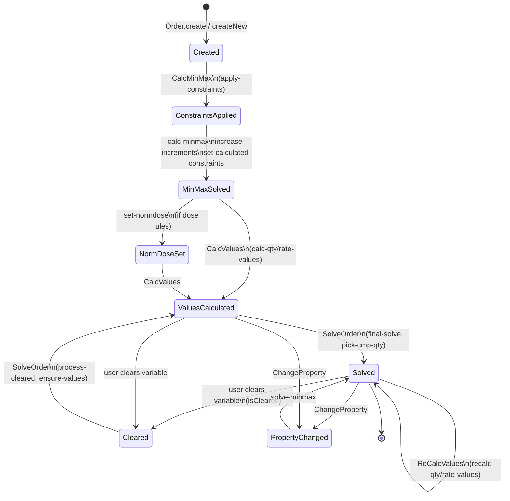

# Order Finite State Machine (GenORDER)

This document describes the finite state machine (FSM) governing the lifecycle of
an `Order` in `Informedica.GenORDER.Lib`.

The FSM models the **solver lifecycle** of an order, as implemented in
`src/Informedica.GenORDER.Lib/OrderProcessor.fs`. States correspond to the flags
in the `OrderState` record (`OrderProcessor.fs:408`); transitions correspond to
the commands processed by `processPipeline` (`OrderProcessor.fs:468`).

> **Note:** The `Schedule` discriminated union
> (`Once | OnceTimed | Continuous | Discontinuous | Timed`, `Types.fs:230`) is
> **orthogonal** to this FSM. It is a type tag that selects which equation set the
> solver uses (`Order.solve`, `Order.fs:3377`), not a lifecycle state.

## State Diagram



## States

States map to the `OrderState` flags (`OrderProcessor.fs:408`):

| State | Flag |
|-------|------|
| Created | `IsConstraintsNotApplied = true` |
| ConstraintsApplied | constraints set |
| MinMaxSolved | `CanSetNormDose` ready |
| NormDoseSet | norm dose applied |
| ValuesCalculated | `HasValues = true` |
| Solved | `DoseIsSolved` / `OrderIsSolved = true` |
| Cleared | `IsCleared = true` |

## Transitions

Transitions are the pipeline commands handled by `processPipeline`
(`OrderProcessor.fs:468`):

- `CalcMinMax` — apply-constraints → calc-minmax → increase-increments → set-calculated-constraints → (optional) ensure-dose-values → set-normdose
- `IncreaseIncrements` — increase-increment
- `CalcValues` — calc-qty-values → (optional) calc-rate-values
- `SolveOrder` — (optional) process-cleared → (optional) ensure-values → final-solve → pick-cmp-qty
- `ReCalcValues` — apply-calculated-constraints → recalc-qty-values → (optional) recalc-rate-values → (optional) final-solve
- `ChangeProperty` — change-property → solve-minmax

## Cleared Sub-States

The `Cleared` state is refined by the active pattern at `OrderProcessor.fs:26`:

```
FrequencyCleared | RateCleared | TimeCleared
| ConcentrationCleared | DoseQuantityCleared | DosePerTimeCleared | NotCleared
```

Each cleared variable is handled by a dedicated processor that resets dependent
variables before re-solving:

- `processClearedFrequency` (`OrderProcessor.fs:216`)
- `processClearedDose` (`OrderProcessor.fs:243`)
- `processClearedRate` (`OrderProcessor.fs:274`)
- `processClearedOrder` (`OrderProcessor.fs:303`) — dispatcher with schedule-specific logic

## Source References

- `Order` type — `src/Informedica.GenORDER.Lib/Types.fs:211`
- `Schedule` DU — `src/Informedica.GenORDER.Lib/Types.fs:230`
- `OrderState` record — `src/Informedica.GenORDER.Lib/OrderProcessor.fs:408`
- `PrescriptionKind` DU — `src/Informedica.GenORDER.Lib/OrderProcessor.fs:389`
- `classify` — `src/Informedica.GenORDER.Lib/OrderProcessor.fs:421`
- `processPipeline` — `src/Informedica.GenORDER.Lib/OrderProcessor.fs:468`
- `solve` — `src/Informedica.GenORDER.Lib/Order.fs:3377`
