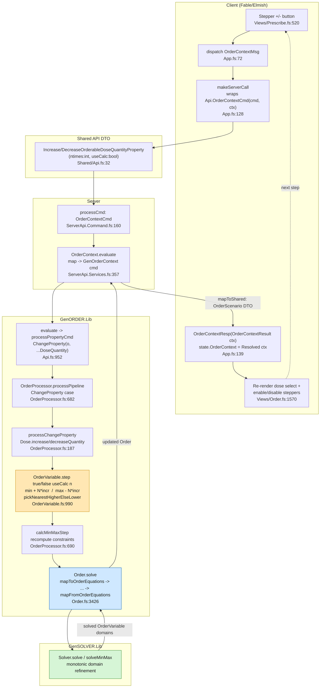
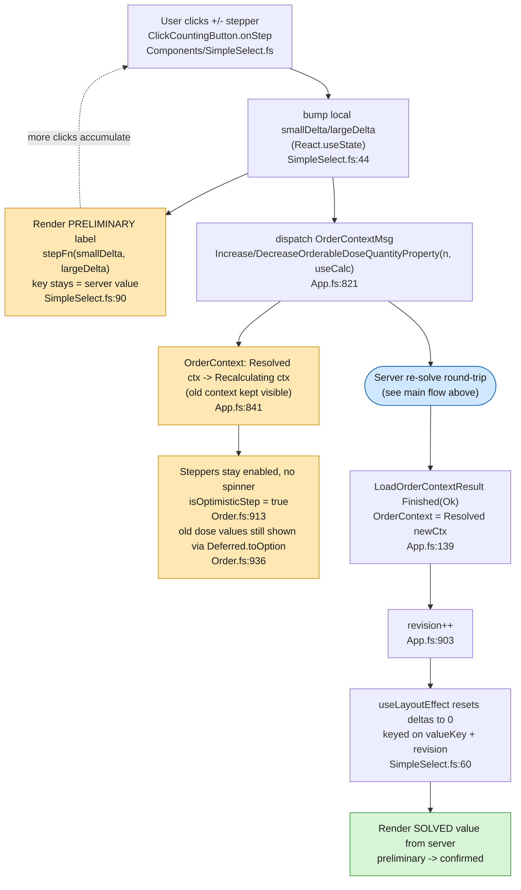

# Dose Quantity Stepping Flow

How `Order.Dose.Quantity` is handled by the UI when the user steps the dose
quantity up/down and the order is re-solved. Every step round-trips through the
server and the constraint solver — the client never computes the value locally.

## Zoom-in: client-side optimistic stepping

The client does **not** block while the server re-solves. It shows a
*preliminary* stepped value immediately using local delta state, keeps the
previous solved context visible (`Deferred.Recalculating`), and reconciles when
the server response arrives. Rapid clicks accumulate into the delta rather than
firing one blocking round-trip each.

### Deferred state cases (`Extensions.fs:16`)

| Case | Meaning | UI effect |
| ---- | ------- | --------- |
| `HasNotStartedYet` | no request yet | empty |
| `InProgress` | in flight, **no** prior value | loading placeholder / spinner |
| `Recalculating of 't` | in flight, **prior value kept** | preliminary value stays visible |
| `Resolved of 't` | response received | confirmed value |

Stepping uses **`Recalculating`** (not `InProgress`), which is why the previous
dose quantity remains on screen as a preliminary result instead of blanking out.
The orange nodes are the preliminary (awaiting-server) phase; green is the
confirmed solver result.

## Key points

- **Stepping is server-side**, not local: every `+`/`-` round-trips through the
  solver. The client only dispatches
  `Increase/DecreaseOrderableDoseQuantityProperty(ntimes, useCalc)` and renders
  the result.
- **`useCalc`** flag decides whether stepping uses calculated constraints vs
  defined ones (`OrderVariable.step`).
- **The step math** (`OrderVariable.fs`): increase = `min + N*incr`,
  decrease = `max - N*incr`, then `pickNearestHigherElseLower` snaps to a
  feasible value in the variable's domain.
- **Re-solve**: after the property change, `calcMinMaxStep` recomputes
  constraints and `Order.solve` feeds equations to GenSOLVER, which returns
  refined domains mapped back into the `OrderScenario` DTO.

## Source references

| Hop | File | Symbol |
| --- | ---- | ------ |
| UI stepper | `src/Informedica.GenPRES.Client/Views/Prescribe.fs:520` | `Increase/DecreaseOrderableDoseQuantityProperty` |
| Elmish msg | `src/Informedica.GenPRES.Client/App.fs:72` | `OrderContextMsg` |
| Server call | `src/Informedica.GenPRES.Client/App.fs:128` | `makeServerCall` |
| Shared DTO | `src/Informedica.GenPRES.Shared/Api.fs:32` | `OrderContextCommand` |
| Server cmd | `src/Informedica.GenPRES.Server/ServerApi.Command.fs:160` | `processCmd` |
| Server service | `src/Informedica.GenPRES.Server/ServerApi.Services.fs:357` | `OrderContext.evaluate` |
| GenORDER eval | `src/Informedica.GenORDER.Lib/Api.fs:952` | `evaluate` / `processPropertyCmd` |
| Pipeline | `src/Informedica.GenORDER.Lib/OrderProcessor.fs:682` | `processPipeline` |
| Property change | `src/Informedica.GenORDER.Lib/OrderProcessor.fs:187` | `processChangeProperty` |
| Step math | `src/Informedica.GenORDER.Lib/OrderVariable.fs:990` | `step`, `pickNearestHigherElseLower` |
| Constraint recalc | `src/Informedica.GenORDER.Lib/OrderProcessor.fs:690` | `calcMinMaxStep` |
| Solve | `src/Informedica.GenORDER.Lib/Order.fs:3426` | `solve` |
| UI re-render | `src/Informedica.GenPRES.Client/Views/Order.fs:1570` | dose quantity select |
